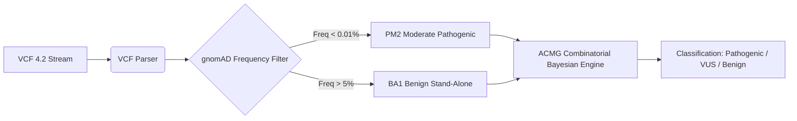

# Helix Genomic Variant Annotator

> **Clinical Bioinformatics & ACMG/AMP 2015 Variant Classification Pipeline**  
> Parsing Variant Call Format (VCF 4.2), gnomAD Allele Frequencies, and Pathogenicity Rules.

---

### Citation

```bibtex
@software{helix_genomic_annotator2026,
  author = {Swami, Naman},
  title = {Helix: OpenGAP Clinical Variant Annotation Engine},
  year = {2026},
  url = {https://github.com/naman-swami/helix-genomic-annotator}
}
```

---

### ACMG/AMP 2015 Classification Architecture



### Evaluated ACMG Evidence Criteria

The internal classifier (`classifiers/acmg_rule_engine.py`) benchmarks against the ACMG 28-rule standard:

- **BA1 (Stand-alone Benign)**: Population allele frequency in gnomAD exceeds $5.0\%$.
- **BS1 (Strong Benign)**: Population frequency exceeds disease-specific threshold ($1.0\%$).
- **PM2 (Moderate Pathogenic)**: Extremely low or absent frequency in control cohorts ($< 0.01\%$).
- **PP3 (Supporting Pathogenic)**: Multiple lines of in-silico computational evidence predict damaging impact.

---

### VCF Annotation Sample Run

```bash
# Annotate benchmark ClinVar and patient VCF variants
python annotate.py --demo

# Execute clinical bioinformatics validation tests
pytest tests/ -v
```

Reference datasets, schema specifications, and ClinVar calibration samples reside in `data/reference/` and `schemas/`. Provenance documentation is registered in [EXPLAINABILITY.md](EXPLAINABILITY.md).
